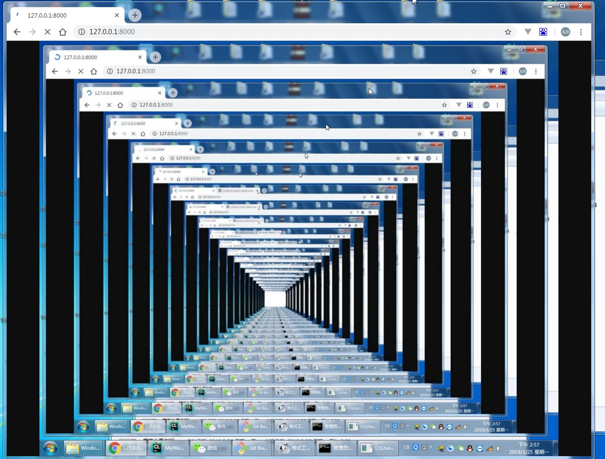
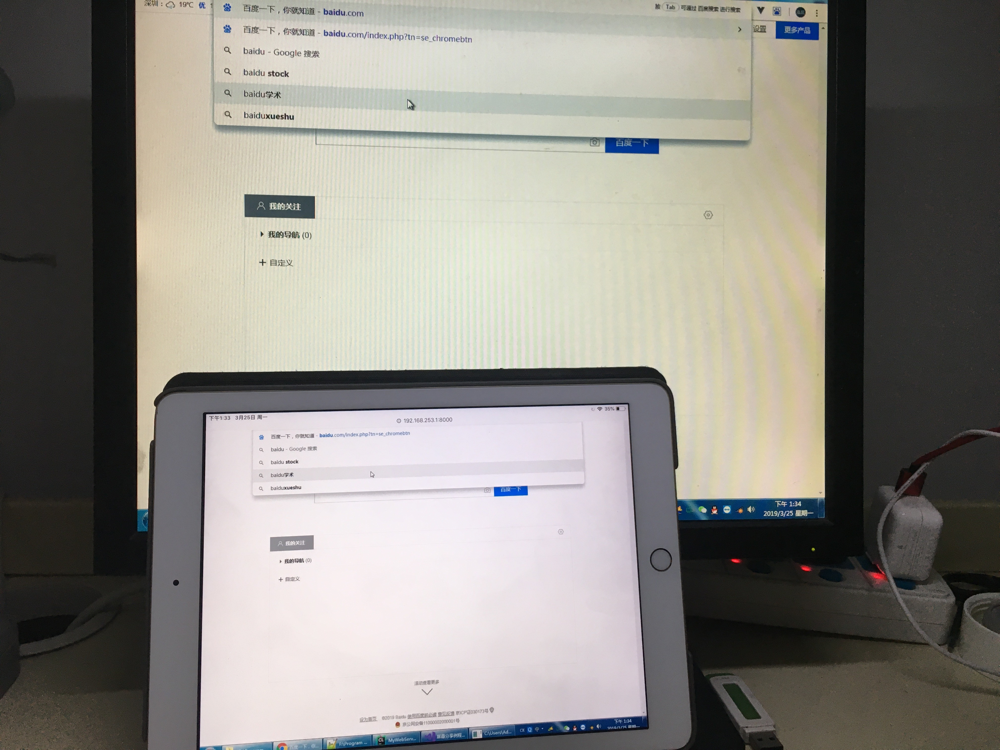
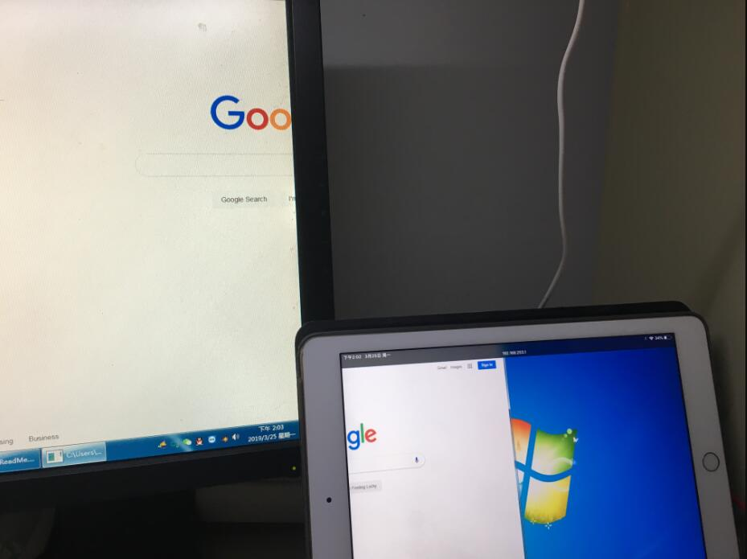
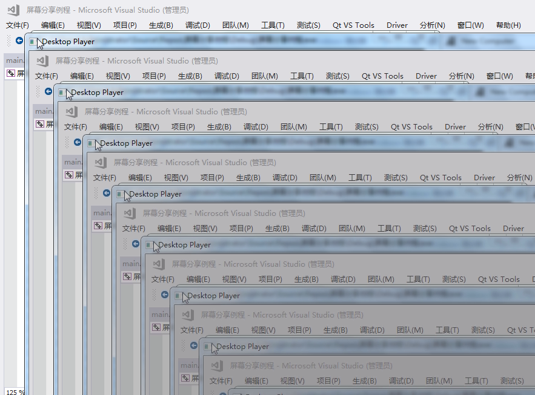

### 快速开始

点击release文件夹下屏幕分享例程.exe，然后访问 [127.0.0.1:8000][http://127.0.0.1:8000] 即可看到如下,在release目录下可看到录屏文件save.h264(使用vlc播放器等即可播放，或使用ffmpeg转码)

### 介绍

该程序实现windows的录屏，投屏功能。

- 屏幕复制

- 拓展屏投屏

  拓展屏是使用一款软件开启的一个虚拟屏幕

  

- 屏幕录制

  使用ffmpeg开发库，录制的视频编码格式可指定为h264或者mpeg，会在本地生成文件，使用vlc播放器即可播放，或者使用 `ffmpeg -i save.h264 -codec copy save.mp4` 

  命令转换为mp4格式。

- SDL播放器播放测试

  SDL为windows下的一个播放器，实现实时内容播放。

### 编译环境

VS2017 + ffmpeg

其中我已经提供了x86平台下的ffmpeg开发库。

[http://127.0.0.1:8000]: 